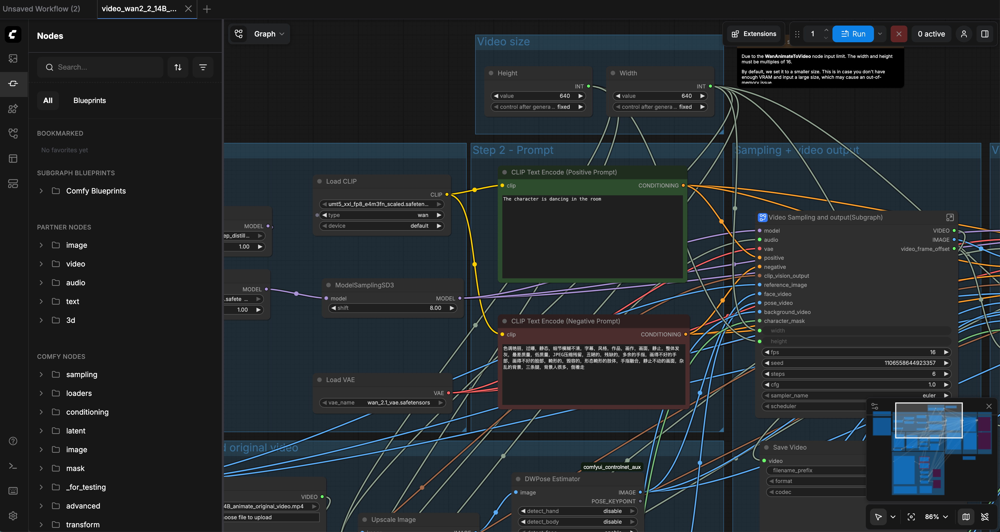
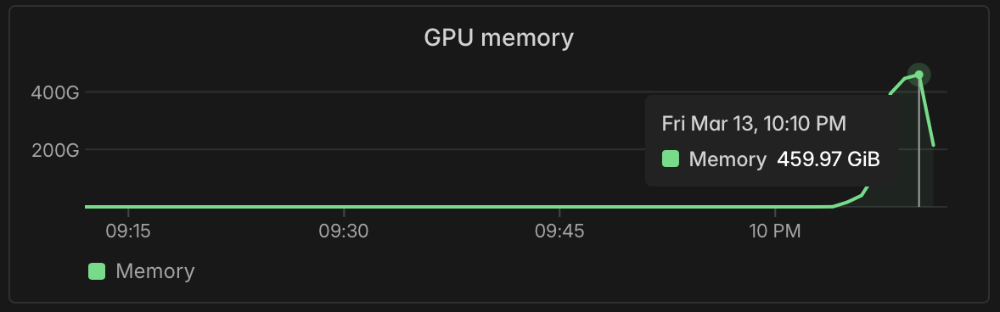
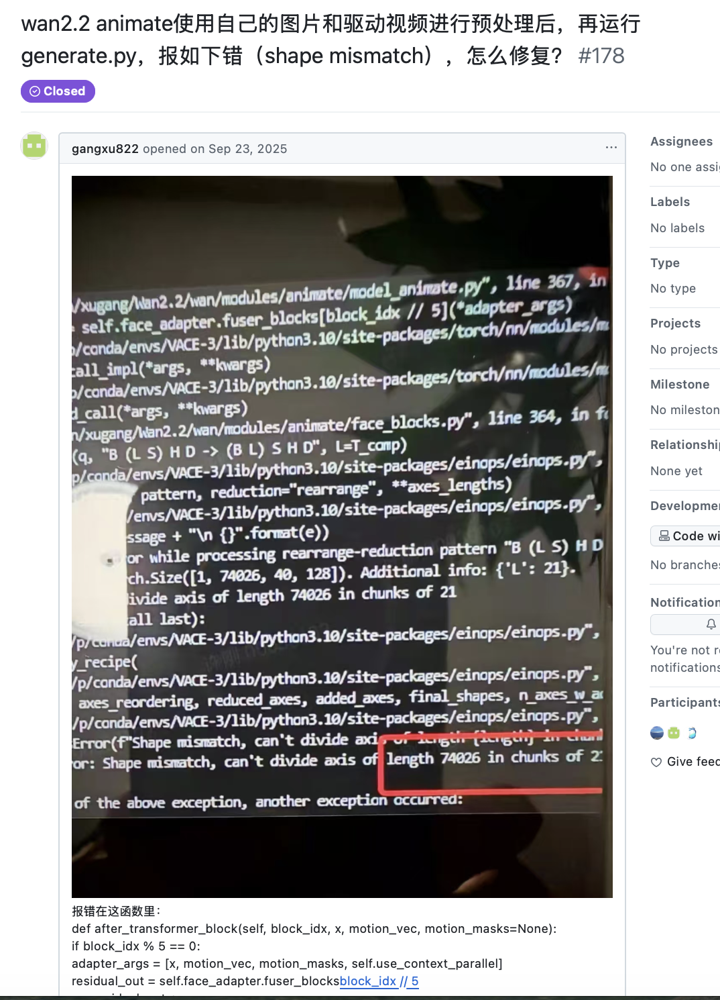
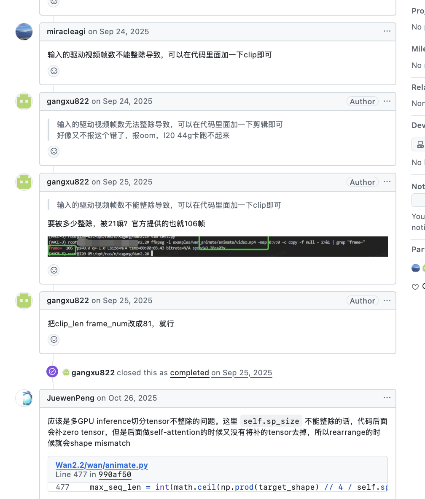
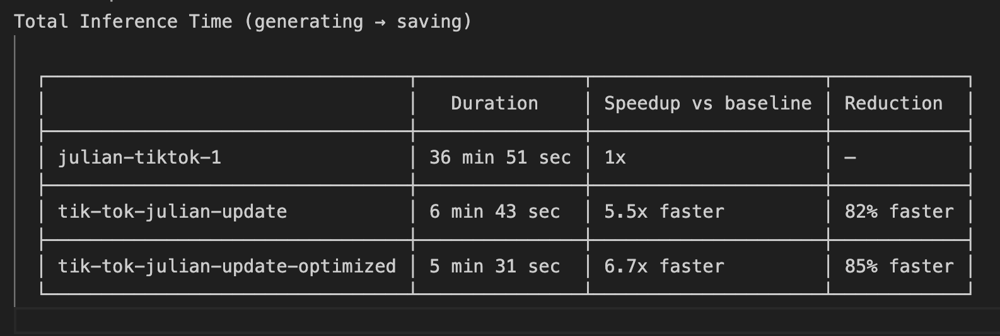

*Disclaimer: ideas here are mine, but claude helped flesh-out the post.*


# I Tried to Run an Open-Source Chinese Video Model. Here's What Actually Happened.

I was doomscrolling Instagram and saw this video of a guy replacing himself with the cast of Stranger Things. Same movements, same scene, just different characters swapped in. It was insane. Given the theme of this week at Fractal Tech, I thought "I wonder if I could do that myself?"

Turns out there's an open-source model called [Wan 2.2 Animate](https://github.com/Wan-Video/Wan2.2) that does exactly this. It's a 14-billion parameter video model from Tongyi Lab with two modes: **replace** (swap a character into an existing video) and **animate** (take a still image and make it move like someone in a reference video). How hard could it be?

Pretty hard, as it turns out. Here's what the next few days actually looked like.

## The container that wouldn't build

Wan 2.2 needs a minimum of 80GB of VRAM just to run. I don't have that kind of hardware lying around, so I chose [Modal](https://modal.com) for cloud GPU compute. Step one was building a container image with all the dependencies.

The README says `pip install -r requirements.txt`. That did not work.

What followed was a long slog through dependency hell: CUDA toolkit version mismatches, PyTorch ABI incompatibilities, packages that expected different versions of each other. I'm not a GPU programmer or an ML researcher, so most of this was new territory. Claude handled the bulk of the debugging, but it wasn't a clean path. We'd fix one thing and another would break.

## It works (badly)

After finally getting the container to build, I got replace mode running. You give it a video of yourself and an image of a character, and it swaps the character in. And it worked! Sort of. The replacement was there, but the background was full of artifacts, a lot of flickering and blinking.

I dug into the preprocessing pipeline to understand why. The way Wan 2.2 works is that before the video model ever runs, there's a series of preprocessing steps: a masking step that blocks out the original character for infill, a pose estimation step that infers 3D body geometry, and a control net that feeds all this to the diffusion model. When I looked at my mask output, it was a single black rectangle covering the entire body. Just one big box. That meant the model had to hallucinate everything inside that box from scratch, including background details it shouldn't have needed to touch.

Then I watched a ComfyUI tutorial for Wan 2.2, and their masking was way better. They had a bunch of smaller rectangles tightly hugging the limbs and head, leaving the background mostly untouched. I assumed this was something they were doing with a custom ComfyUI setup, so I spent a bunch of time trying to deploy ComfyUI on Modal, which was its own nightmare of getting a node-based UI to run headlessly in the cloud.



This was a huge red herring. Eventually I just exported the ComfyUI workflow, fed it to Claude alongside my pipeline, and asked it to diff them. Turns out they weren't doing anything special. There was a parameter controlling mask resolution that was set wrong in my pipeline. A few args changed, and suddenly the masking was fine-grained, the background was stable, and the output quality jumped dramatically.

Here's what the preprocessing output looks like after the fix. 

<video src="../preprocess_results_fixed/src_bg.mp4" controls width="100%"></video>
*Background mask -- the fine-grained masking tightly follows the body instead of one big rectangle*

<video src="../preprocess_results_fixed/src_pose.mp4" controls width="100%"></video>
*Pose estimation -- 3D body geometry inferred from the driving video*

The lesson is almost embarrassingly simple: before building an elaborate workaround, check whether the thing you already have is just misconfigured.

## The parallelization wall

Replace mode was now working well enough, running in maybe 5-10 minutes on a single GPU. But I also wanted animate mode working, and that's where things got expensive.

On a single GPU, animate mode inference took about 37 minutes. At cloud GPU rates, that's not exactly a fun side project budget. The obvious move was to parallelize across multiple GPUs using [DeepSpeed-Ulysses](https://github.com/microsoft/DeepSpeed), a sequence parallelism strategy that splits the token sequence across GPUs. I spun up 8x H200s and added the `--ulysses_size 8` flag.



It immediately crashed.

```
einops.EinopsError: Shape mismatch, can't divide axis of length 31900 in chunks of 21
```

Claude's first attempt at a fix was lazy. It basically disabled proper parallelization in a way that still technically spread work across GPUs, but inefficiently with a lot of redundant computation. The result: 40 minutes and $50 for one janky video. Not the improvement I was looking for.

So I went deeper. I had Claude spin up research agents to investigate the package ecosystem around DeepSpeed-Ulysses and Wan 2.2. It found [GitHub issue #178](https://github.com/Wan-Video/Wan2.2/issues/178) -- written entirely in Chinese with a community contributor's fix that had never been merged into the official repo.





Claude applied it as a build-time monkey-patch, and it worked.

The results:



|  | Duration | Speedup | Reduction |
|---|---|---|---|
| Baseline (1 GPU) | 36 min 51 sec | 1x | -- |
| Ulysses fix (8 GPUs) | 6 min 43 sec | 5.5x | 82% faster |
| Ulysses + optimized | 5 min 31 sec | 6.7x | 85% faster |

That's a 6-7x speedup on inference, bringing total generation from ~37 minutes down to ~5.5 minutes on 8x H200s.

## Side-by-side comparisons

Here are the actual results. These are the same TikTok dance driving video with the same reference character, showing how quality improved at each stage:

- **Baseline** (single GPU, bad masking): Heavy background flickering, artifacts around the character edges, ~37 minutes to generate
- **After mask fix**: Background is stable, character edges are much cleaner, same generation time
- **After mask fix + Ulysses parallelization**: Same quality as the mask fix, but generated in ~5.5 minutes instead of 37

<video src="../comparisons/comparison-tiktok-dance.mp4" controls width="100%"></video>
*Baseline vs. improved -- the difference the mask resolution fix makes*

<video src="../comparisons/comparison-tiktok-dance-update.mp4" controls width="100%"></video>
*Updated result with mask fix applied*

<video src="../comparisons/comparison-tiktok-dance-2.mp4" controls width="100%"></video>
*Additional comparison -- different segment*

## What I actually learned

I learned more about how video diffusion models actually work in a few days of debugging than I would have from any tutorial. I now understand what preprocessing pipelines look like for video generation, how sequence parallelism distributes work across GPUs, why mask resolution matters for infill quality, and what it actually takes to deploy a 14B parameter model in the cloud. None of that shows up when you hit "generate" on an API.

Open-source AI models are not plug-and-play. The gap between "weights are on Hugging Face" and "this actually runs" is real, and it's full of CUDA bugs, unmerged patches, and parameters that the README doesn't mention. But if you're trying to build intuition for how this stuff works under the hood, there's no substitute for getting your hands dirty.
